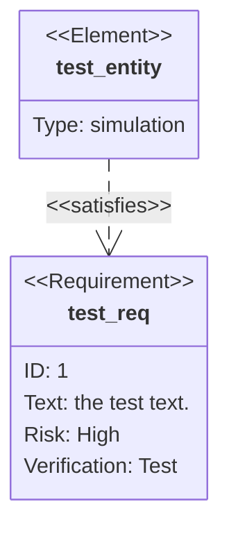

# 文档

`Toolkit` 是一套用于解决重复CURD的工具包，其设计初衷是为了尽量减少重复代码的编写

## 为什么创建一套Toolkit

工作中会经常用到类似于模板似的框架类似于[Ruoyi](https://ruoyi.vip/)、[Jeecg boot](http://www.jeecg.com/)
这些框架是一套完整的解决方案，就好比我需要做一份晚餐，食材、调料、厨具已经提供给我了，我只需要拿起勺子炒巴炒巴，一份晚餐就可以做好了。

问题也出在这里，我们并不是时时刻刻都需要做一份晚餐，有些时候可能只是煮一包方便面，我只需要开水和一口锅而已。

上述框架解决了大部分的CURD开发问题 但是对于技术洁癖来说 还是不够优秀


## Toolkit 设计思路

同样是基于现有主流技术进行封装 但是与上述框架/模板不同的是 `Combined` 组合式架构

借助主流框架的插件化功能例如 Spring boot 的 starter



## Generate a new site

Generate a new Docusaurus site using the **classic template**.

The classic template will automatically be added to your project after you run the command:

```bash
npm init docusaurus@latest my-website classic
```

You can type this command into Command Prompt, Powershell, Terminal, or any other integrated terminal of your code editor.

The command also installs all necessary dependencies you need to run Docusaurus.

## Start your site

Run the development server:

```bash
cd my-website
npm run start
```

The `cd` command changes the directory you're working with. In order to work with your newly created Docusaurus site, you'll need to navigate the terminal there.

The `npm run start` command builds your website locally and serves it through a development server, ready for you to view at http://localhost:3000/.

Open `docs/intro.md` (this page) and edit some lines: the site **reloads automatically** and displays your changes.
